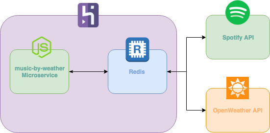

# music-by-weather

### Resumo de funcionamento
Este microsserviço em NodeJS tem como objetivo retornar uma playlist de músicas de acordo com a temperatura da cidade informada baseado nos seguintes critérios:
- Se a temperatura for maior que 25ºC, o gênero das músicas será pop
- Se a temperatura estiver entre 10ºC e 25ºC, o gênero das músicas será rock
- Se a temperatura estiver abaixo de 10ºC, o gênero das músicas será clássica

Para identificar a temperatura atual de uma cidade, utilizamos a API do [OpenWeatherMaps](https://openweathermap.org/api). Sendo essa informação armazenada em cache no Redis com um tempo de expiração de 30 minutos por cidade.

Para sugerir uma playlist, foi utilizada a API do [Spotify](https://developer.spotify.com). As informações são armazenadas em cache no Redis com o tempo de expiração de 20 minutos por gênero. Além disso, dos 50 resultados da API, retornamos apenas 10 de forma aleatória. Então, por mais que os resultados estejam em cache, o resultado será sempre único.

### URL
GET https://music-by-weather.herokuapp.com/playlist/campinas

### Topologia


### Estrutura de diretórios
```
    .
    ├── server          # Arquivos contendo as configurações gerais do servidor da aplicação
    ├── src             # Aqui estão todos os arquivos fonte
    |   ├── lib             # Arquivos contendo a parte lógica da aplicação
    |   ├── models          # Aqui vão os arquivos responsáveis por persistir os dados
    |   ├── services        # Arquivos que servem como intermediadores entre a camada lógica
    |   └──  utils          # Helpers para auxiliar no tratamento de dados
    └── test           # Sim, temos testes unitários!
```

### Swagger
Utilizamos [swagger](swagger.yaml) para definições de contrato de todos os endpoints.
Para visualizar: https://editor.swagger.io/

### Variáveis de ambiente
```
REDIS_URL=redis://{Redis host}:{Redis port}
OPENWEATHER_API_KEY={chave da API do OpenWeather}
SPOTIFY_CLIENT_ID={client id da API do Spotify}
SPOTIFY_CLIENT_SECRET={client secret da API do Spotify}
````

### Instalação
Para executar a aplicação em ambiente local, basta executar os seguintes comandos no terminal: 
```bash
git clone https://github.com/adriano-matsuo/music-by-weather
cd music-by-weather
sudo npm install
npm start # ou npm run dev
```

A aplicação estará rodando em http://localhost:3000.
Observação: você deverá ter um servidor Redis rodando, local ou remoto.

### Testes
Com a aplicação instalada, para executar os testes unitários, utilize o comando `npm test` no terminal.
